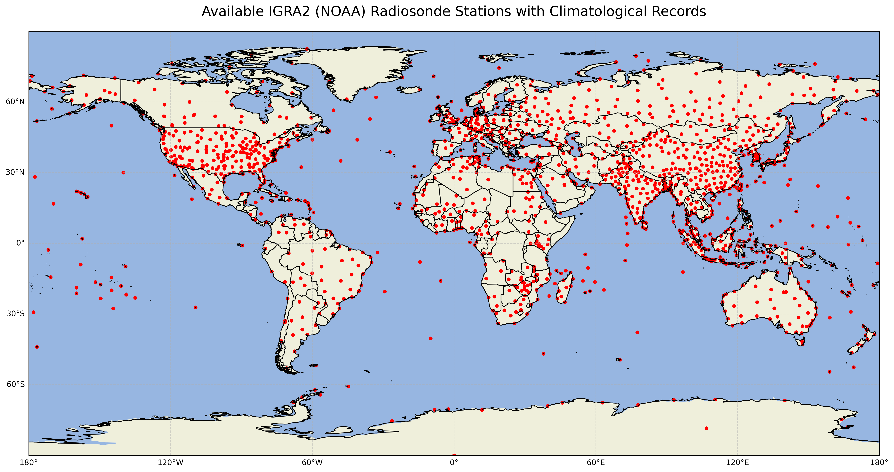
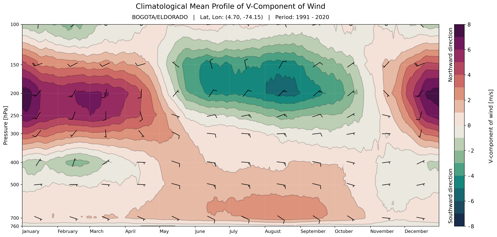

# Radiosonde Climatology Analysis

Author: David Garzón Casas (dgarzonc@unal.edu.co)  - July 2025

A comprehensive Python toolkit for processing and visualizing atmospheric radiosonde climatologies from IGRA-2 (Integrated Global Radiosonde Archive) data.

## Overview

This repository provides a complete pipeline for analyzing historical radiosonde data, from station selection to climatological visualization. The toolkit handles the complexities of IGRA-2 data format, processes non-standardized pressure levels, and generates detailed climatological atmospheric profile plots.

## Features

- **Automated station selection** from IGRA-2 database
- **Robust data processing** for IGRA-2's complex text format
- **Climatological calculations** with daily resolution and moving averages
- **Multi-variable visualization** with customizable color schemes

## Data Source

This toolkit processes data from:
- **IGRA-2 (Integrated Global Radiosonde Archive Version 2)**
- **NOAA National Centers for Environmental Information**
- **Global coverage**: 2,700+ stations worldwide
- **Temporal range**: 1905-present (varies by station)
  

## Example Case Study

All notebooks demonstrate the complete workflow using **Bogotá, Colombia** radiosonde station (IGRA ID: COM00080222) as a representative tropical highland location, showcasing the seasonal atmospheric structure over the Colombian Andes. There are also examples of climatological plots for several radiosonde stations in Central and South America in the folder `figures/`.

## Pipeline Structure

The analysis is organized in four sequential notebooks:

### 1. `01_select_station.ipynb`
- Browse and select radiosonde stations from IGRA-2 database
- Filter stations by location, data availability, and temporal coverage

### 2. `02_download_and_process_data.ipynb`
- Download historical radiosonde data from NOAA IGRA-2
- Parse complex IGRA-2 text format
- Standardize pressure levels

### 3. `03_calculate_climatologies.ipynb`
- Compute daily climatological means
- Apply moving average smoothing techniques
- Generate climatologies for multiple atmospheric variables

### 4. `04_plot_climatologies.ipynb`
- Create pressure-time climatological cross-sections
- Generate multi-variable atmospheric profiles

## Supported Variables

- Air Temperature
- Relative Humidity
- Geopotential Height
- Wind Components (U/V)
- Wind Speed & Power Density
- Dewpoint Temperature
- Vapor Pressure
- Specific Humidity
- Potential & Equivalent Potential Temperature
- Air Density

---

**Note**: This is an independent research tool and is not affiliated with NOAA or IGRA-2. Please cite original data sources when using IGRA-2 data in publications.